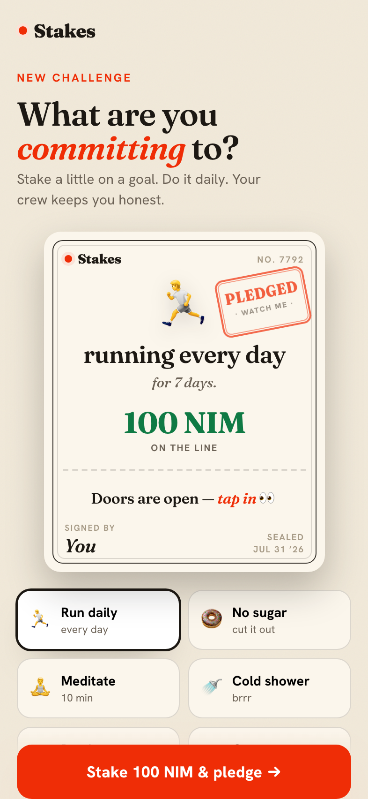
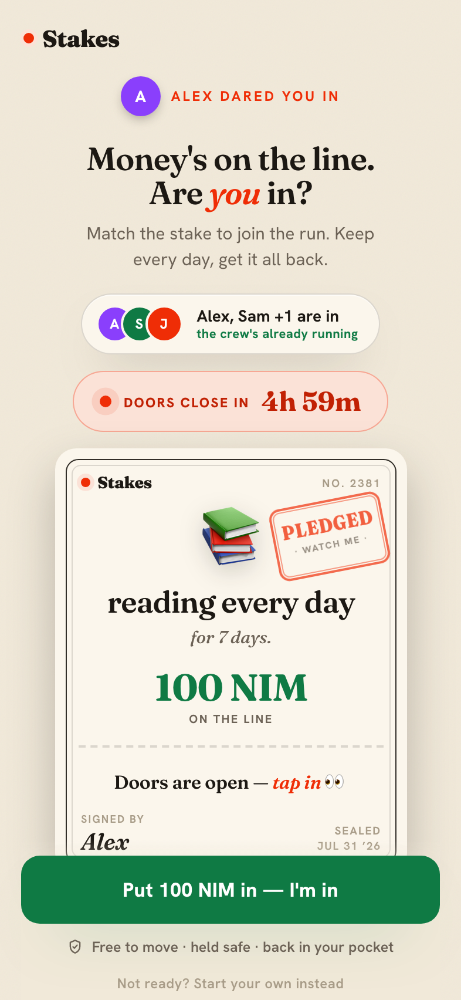
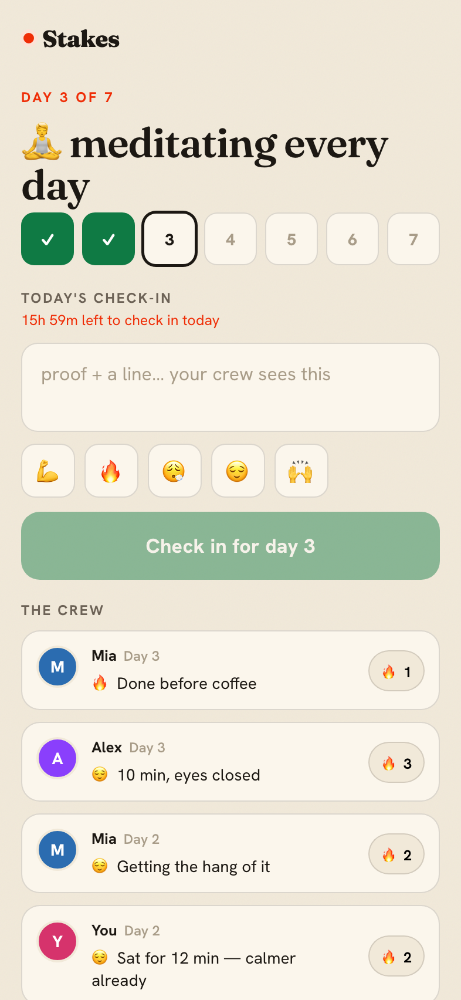
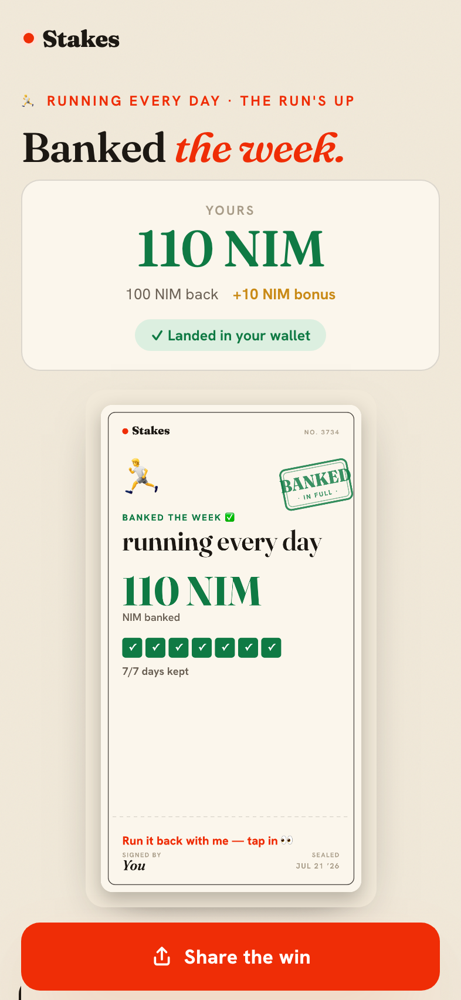

# Stakes


> **An app to quit quitting.**

**Stakes** is a **social commitment game** built as a [Nimiq Pay](https://www.nimiq.com/nimiq-pay/) Mini App. You stake a small amount of NIM on a personal goal for a week, do it daily — kept honest by your friends and social proof, *not* surveillance — and reclaim your stake plus a share of what the quitters forfeit (plus a little NIM) if you follow through. Miss a day, forfeit that day's slice.

Built for the **[Nimiq Mini Apps Competition](https://miniappscompetition.com/)**, Cycle I. Live on **mainnet** at **[stakes.surfstyk.com](https://stakes.surfstyk.com)** (open inside Nimiq Pay) · **[▶ 2-min demo](https://www.youtube.com/watch?v=ptgumWH57r4)** · **[📖 the story](https://blog.surfstyk.com/the-key-i-left-in-2021/)**.

<p align="center">
  
  
  
  
</p>

## Two ideas at the core
- *The money's job is to be **at risk**, not to be **won**.* The stake is working capital for your willpower.
- *Trust, not surveillance.* Your crew keeps you honest — no activity tracking, no proof-of-workout, no AI watching you. The app can't tell whether you actually went for the run; your friends can.

## How it works
1. **Create** a challenge — pick a goal, a per-person stake, and a length (3–30 days).
2. **Invite your crew.** Everyone opens the link in Nimiq Pay and stakes the same amount to join.
3. **Check in** once a day, every day. Miss the day's window and that day's slice of your stake is forfeited.
4. **Settle.** When the challenge ends, finishers get their stake back, a share of the forfeited pool, and a small NIM completion bonus.

## The money
Stakes are real NIM, moved inside Nimiq Pay. In this **Cycle-I build the money layer is custodial**: participants deposit their stake to a Stakes-run treasury, and payouts are settled automatically when the challenge ends. It is built behind a swappable `StakeVault` interface (`src/vault/`) so a **trustless on-chain escrow (USDT) can slot in for Cycle II** without changing the product. The settlement math is a single pure function (`src/vault/settlement.ts`) shared by both the app and the settlement job, so the preview you see and the on-chain payout can't diverge. There is **no game of chance** — every outcome is determined purely by who checked in.

## Architecture
- **Front end** — a Vite + React single-page app that runs inside the Nimiq Pay WebView, talking to the wallet over [`@nimiq/mini-app-sdk`](https://nimiq.dev/mini-apps/) (list accounts, NIM payments, message signing). Share cards are rendered to canvas; all brand copy and theme are centralized in `src/brand/`.
- **API** — a small, dependency-free Node service (`node:http` + `node:sqlite`) in `server/` that stores challenges, participants, and check-ins. It binds to loopback and sits behind a reverse proxy in production.
- **Settlement** — an offline operator job (`server/settle.ts`) that reads the on-chain stake deposits, signs the payout transfers, and broadcasts them over JSON-RPC. The treasury signing key stays on that offline machine and never touches the internet-facing box.

## Run it locally
Requires **Node ≥ 22** (the API uses the built-in `node:sqlite`).

```bash
npm install
npm run api    # local API on http://127.0.0.1:8787 (SQLite at server/stakes.db)
npm run dev    # the SPA via Vite (proxies /api to the local API)
```

Open the printed URL. With no treasury address configured, the app uses a **mock money layer**, so the whole create → join → check-in → settle loop runs in a plain browser with no real funds.

Append **`?test`** to the URL for a fast clock (a 2-minute join window and 3-minute "days") to run a full challenge in minutes. `?test` and the `?recon` dual-chain diagnostics are **dev-only** and compiled out of the public build.

## Build

```bash
npm run build         # dev / testnet build — keeps the ?test and ?recon dev tools
npm run build:public  # submission build — dev tools stripped and tree-shaken out
```

The deployed site is the output of `build:public` (`dist/`), served as a static SPA.

## License
[MIT](./LICENSE) © 2026 Hendrik Bondzio.
